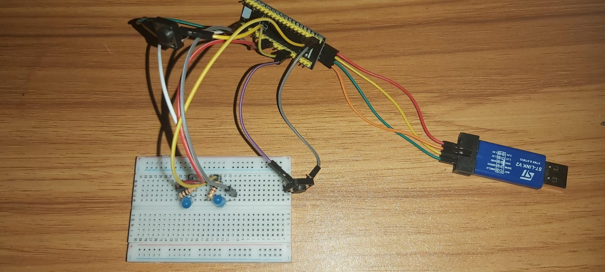

# LED Variasi Interrupt - STM32F401CCU6 Project

Proyek ini merupakan implementasi pengendalian 3 LED dengan 2 tombol menggunakan interrupt eksternal dan teknik debouncing berbasis STM32F401CCU6. Proyek dibuat menggunakan **STM32CubeIDE** dan memanfaatkan **HAL Library**.

## 📚 Daftar Isi

- [🧠 Fitur Utama](#-fitur-utama)
- [🔄 Tabel Pola LED](#-tabel-pola-led)
- [⚙️ Requirements](#️-requirements)
- [🖼️ Foto Rangkaian](#️-foto-rangkaian)
- [📍 Konfigurasi IOC](#-konfigurasi-ioc)
  - [🧷 Pin Mapping (IOC Screenshot)](#-pin-mapping-ioc-screenshot)
  - [⚙️ Konfigurasi GPIO](#️-konfigurasi-gpio)
  - [⚡ NVIC Settings](#-nvic-settings)
- [🧾 Struktur Folder](#-struktur-folder)
- [🛠️ Cara Build dan Upload](#️-cara-build-dan-upload)
- [💾 Kode Penting](#-kode-penting)
  - [💾 Kode Penting di `main.c`](#-kode-penting-di-mainc)
    - [🛎️ Fungsi Interrupt Tombol](#️-fungsi-interrupt-tombol)
    - [🔁 Loop Utama](#-loop-utama)
- [📹 Demo Video](#-demo-video)

## 🧠 Fitur Utama

- Menggunakan 2 push-button (PA0 dan PA1)
- Tiga LED dikontrol dengan berbagai pola:
  - **PA5 dan PA6** untuk LED utama
  - **PC13** untuk LED onboard
- Interrupt eksternal (EXTI) untuk kedua tombol
- Debouncing berbasis software
- Penggunaan `HAL_GPIO_EXTI_Callback()` untuk deteksi input
- Pola LED dapat diganti-ganti dengan menekan tombol

## 🔄 Tabel Pola LED

| Pola | Deskripsi                     | PA5 (LED1) | PA6 (LED2) | PC13 (LED3 - onboard) |
| ---- | ----------------------------- | ---------- | ---------- | --------------------- |
| 0    | LED Onboard menyala           | OFF        | OFF        | ON                    |
| 1    | LED1 Blinking                 | Blink      | OFF        | ON                    |
| 2    | LED2 Blinking                 | OFF        | Blink      | ON                    |
| 3    | LED1 dan LED2 Blink bersamaan | Blink      | Blink      | OFF                   |

## ⚙️ Requirements

- STM32F401CCU6 + ST-Link V2
- STM32CubeIDE versi terbaru
- Kabel USB dan push-button eksternal
- LED tambahan

## 🖼️ Foto Rangkaian

Berikut adalah gambar rangkaian LED dan tombol:




## 📍 Konfigurasi IOC

### 🧷 Pin Mapping (IOC Screenshot)

Berikut ini adalah tampilan konfigurasi pin di STM32CubeMX:


### ⚙️ Konfigurasi GPIO

- **PA0 dan PA1**: Mode: GPIO_Input, Pull-up, EXTI Trigger: Falling Edge
- **PA5 dan PA6, PC13**: Mode: GPIO_Output, No Pull


### ⚡ NVIC Settings

- Aktifkan EXTI0 dan EXTI1 pada tab NVIC dengan prioritas default (0)


## 🛠️ Cara Build dan Upload

1. Buka `led_variasi_interrupt.ioc` menggunakan **STM32CubeIDE**.
2. Klik **Project > Build Project**.
3. Sambungkan board STM32 ke komputer via ST-Link.
4. Jalankan **Run > Debug As > STM32 Cortex-M C/C++ Application**.
5. Tekan tombol PA0 dan PA1 untuk melihat variasi pola LED.

## 💾 Kode Penting

Beberapa file sumber utama yang relevan:

- `Core/Src/main.c` – logika utama LED & interrupt
- `Core/Inc/main.h` – definisi pin dan variabel
- `Core/Src/stm32f4xx_it.c` – handler interrupt eksternal
- `led_variasi_interrupt.ioc` – konfigurasi pin STM32CubeMX

### 💾 Kode Penting di `main.c`

#### 🛎️ Fungsi Interrupt Tombol

```c
void HAL_GPIO_EXTI_Callback(...) {
uint32_t now = HAL_GetTick();

  if(GPIO_Pin == GPIO_PIN_0 && (now - last_interrupt_time_pb0 > debounce_delay))
  {
	// Tombol PA0 ditekan: ganti mode (0-3)
	mode = (mode + 1) % 4;
    last_interrupt_time_pb0 = now;
  }
  else if(GPIO_Pin == GPIO_PIN_1 && (now - last_interrupt_time_pb1 > debounce_delay))
  {
	 // Tombol PA1 ditekan: reset ke mode 0
    mode = 0;
    last_interrupt_time_pb1 = now;
  }
}
```

#### 🔁 Loop Utama

```c
while (1) {
uint32_t now = HAL_GetTick();
    if (now - last_blink_time >= blink_interval)
    {
      last_blink_time = now;
      blink_state = !blink_state;

      switch (mode)
      {
        case 0:
        // Mode 0 (Default): PC13 menyala, PA5 dan PA6 mati
          HAL_GPIO_WritePin(GPIOC, GPIO_PIN_13, GPIO_PIN_RESET); // PC13 ON
          HAL_GPIO_WritePin(GPIOA, GPIO_PIN_5 | GPIO_PIN_6, GPIO_PIN_RESET); // PA5, PA6 OFF
          break;

        case 1:
        // Mode 1: PC13 menyala, PA5 blink, PA6 mati
          HAL_GPIO_WritePin(GPIOC, GPIO_PIN_13, GPIO_PIN_RESET); // PC13 ON
          HAL_GPIO_WritePin(GPIOA, GPIO_PIN_5, blink_state ? GPIO_PIN_SET : GPIO_PIN_RESET);
          HAL_GPIO_WritePin(GPIOA, GPIO_PIN_6, GPIO_PIN_RESET);
          break;

        case 2:
        // Mode 2: PC13 menyala, PA5 mati, PA6 blink
          HAL_GPIO_WritePin(GPIOC, GPIO_PIN_13, GPIO_PIN_RESET); // PC13 ON
          HAL_GPIO_WritePin(GPIOA, GPIO_PIN_5, GPIO_PIN_RESET);
          HAL_GPIO_WritePin(GPIOA, GPIO_PIN_6, blink_state ? GPIO_PIN_SET : GPIO_PIN_RESET);
          break;

        case 3:
        // Mode 3: PC13 mati, PA5 dan PA6 blink bersamaan
          HAL_GPIO_WritePin(GPIOC, GPIO_PIN_13, GPIO_PIN_SET); // PC13 OFF
          HAL_GPIO_WritePin(GPIOA, GPIO_PIN_5, blink_state ? GPIO_PIN_SET : GPIO_PIN_RESET);
          HAL_GPIO_WritePin(GPIOA, GPIO_PIN_6, blink_state ? GPIO_PIN_SET : GPIO_PIN_RESET);
          break;
      }
    }
  }
}
```

## 📹 Demo Video

Tonton demo pola nyala LED di video berikut:
👉 [YouTube Demo: LED Variasi Interrupt STM32](https://youtube.com/shorts/wgtnLF8KAKQ?feature=share)
